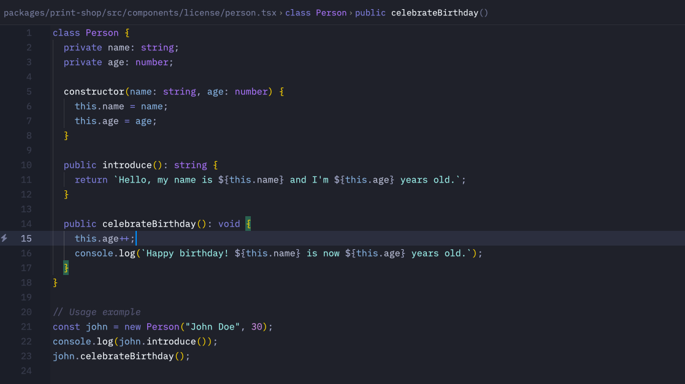

# zed-ariake-theme

Ariake is inspired by Japanese traditional colors and the poetry composed 1000 years ago.

"有明の　つれなく見えし　別れより　暁ばかり　憂きものはなし" - Mibu no Tadamine (壬生忠岑)
> "Since I saw the moon in dawn when you said good-bye, My heart aches every time I see it again."

### How to install
- Copy the theme file (zed-ariake.json) under `~/.config/zed/themes`
- Open Command Palette (cmd+shift+p)
- Select `theme selector:toggle`
- Select `Ariake Dark`

### Attribution
Ariake Dark is Zed theme inspired by the work of [@pathtrk](https://github.com/pathtrk/ariake-dark-syntax) of the same name. The editor styles are influenced by Zed, and the artwork has been ported over.
